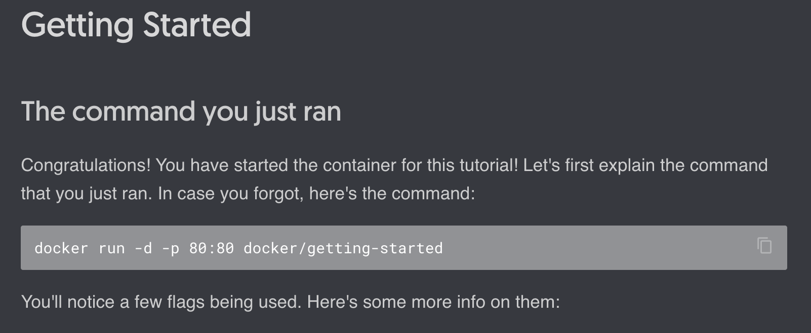

# Docker Basics

Docker defines a container as another process on your machine that has been isolated from all other processes on the host machine.

You can buld your first container with the command:

```console
docker run -d -p 80:80 docker/getting-started
```

Your output should look like this:

```console
Unable to find image 'docker/getting-started:latest' locally
latest: Pulling from docker/getting-started
df9b9388f04a: Pull complete 
5867cba5fcbd: Pull complete 
4b639e65cb3b: Pull complete 
061ed9e2b976: Pull complete 
bc19f3e8eeb1: Pull complete 
4071be97c256: Pull complete 
79b586f1a54b: Pull complete 
0c9732f525d6: Pull complete 
Digest: sha256:b558be874169471bd4e65bd6eac8c303b271a7ee8553ba47481b73b2bf597aae
Status: Downloaded newer image for docker/getting-started:latest
a96279e2907915b8fe0e8526d9c2e486bf4e676f5c0aeaef660e454240ba12db
```

There are a few key things that are happening here.
- Right when you download Docker, you do not have any images.
- When docker first looks to run the container, it looks for the image.
- If it does not have the image, it is downloaded.
- When the image is downloaded, it is stored in the local Docker repository.

The last number is a unique identifier for the image that was just created.

This id is used to identify the image when you run the container.

You can see the running containers by running the command:

```console
docker ps
```

The above command will show all the currently running containers.

Your output should look like this:

```console
CONTAINER ID   IMAGE                    COMMAND                  CREATED         STATUS         PORTS                NAMES
a96279e29079   docker/getting-started   "/docker-entrypoint.…"   8 minutes ago   Up 8 minutes   0.0.0.0:80->80/tcp   sad_driscoll
```

We will dive into the details of the output later, but if you navigate to the URL in your browser, you should see 



You are now running your first container!

Keep going!

# Lessons 01: Web Server and NGINX

Build an NGINX web server in a container.

# Lessons 02: Host Static Site


# Layers 

Each layer only contains the differences between the layers.

```console
Ubuntu
Python
Executables
WebApp/Code
```


There is a writbable cointaier layer.

This layer is where you can write your code.

Several Advantages:
- Share layer between images AND CONTAINERS
- Smalle roverall storageb
- Easily share code between images
- Easily share code between containers
- Faster development and image build.


Only rebuild the layer that changes.

You can see each of the directives if you run the command:

```console
docker image history ubuntu
```
```